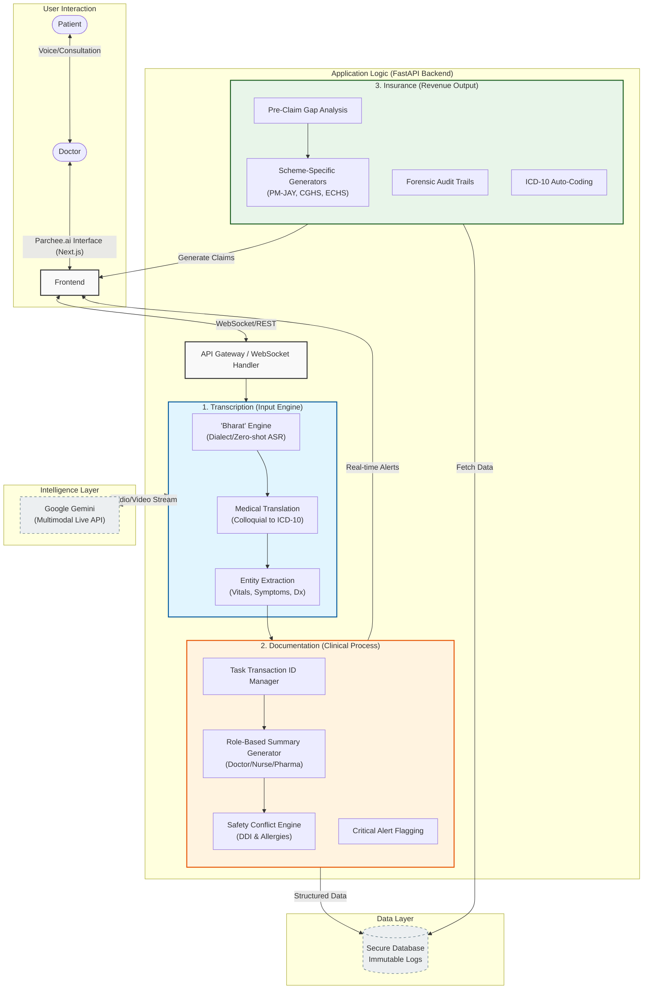

# Parchee.ai System Architecture

The following diagram illustrates the high-level architecture of Parchee.ai, centered around three core pillars: **Transcription**, **Documentation**, and **Insurance**. It highlights the flow from patient interaction to revenue output, powered by a robust backend and advanced AI models.

## detailed Components Breakdown

### 1. Transcription (The Input Engine)
*Primary Goal: Zero-shot support for Indian rural dialects & Code-Switching.*
- **'Bharat' Engine**: Handles *Bhojpuri*, *Maithili*, *Haryanvi* without fine-tuning.
- **Medical Translation**: Maps colloquial terms ("Ghabrahat") to standardized *ICD-10* terminology.
- **Multi-Modal Ingestion**: Captures voice and OCR inputs simultaneously.

### 2. Documentation (The Clinical Process)
*Primary Goal: Ensure accountability and distinct outputs for every stakeholder.*
- **Transaction ID Manager**: Assigns a unique ID to every task for auditability.
- **Role-Based Summaries**: Generates *Clinical Note* (Doctor), *Administer List* (Nurse), and *Dispense List* (Pharmacy).
- **Safety Conflict Engine**: Checks for *Drug-Drug Interactions* and *Allergy Contraindications* in real-time.

### 3. Insurance (The Revenue Output)
*Primary Goal: Prevent revenue leakage and ensure claim acceptance.*
- **Scheme Generators**: Automates forms for *Ayushman Bharat*, *CGHS*, *ECHS*.
- **Pre-Claim Gap Analysis**: Acts as a "Spell Check" for insurance evidence.
- **Forensic Audit Trails**: Timestamped, immutable logs for fraud auditing.
